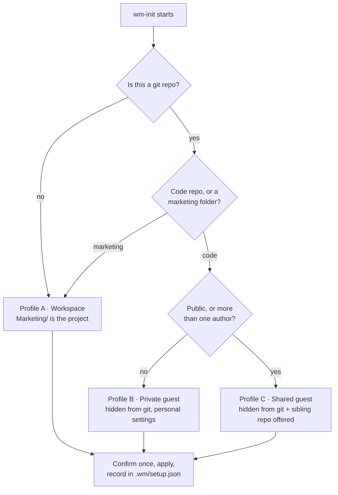
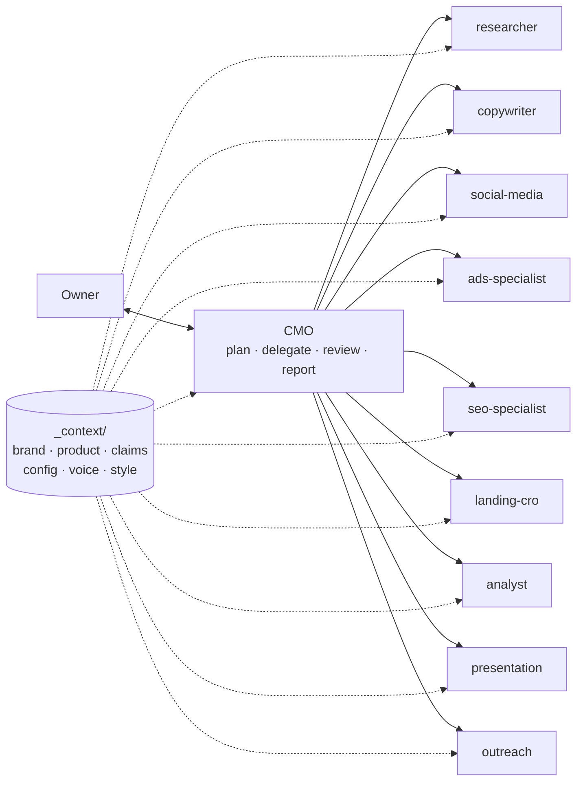
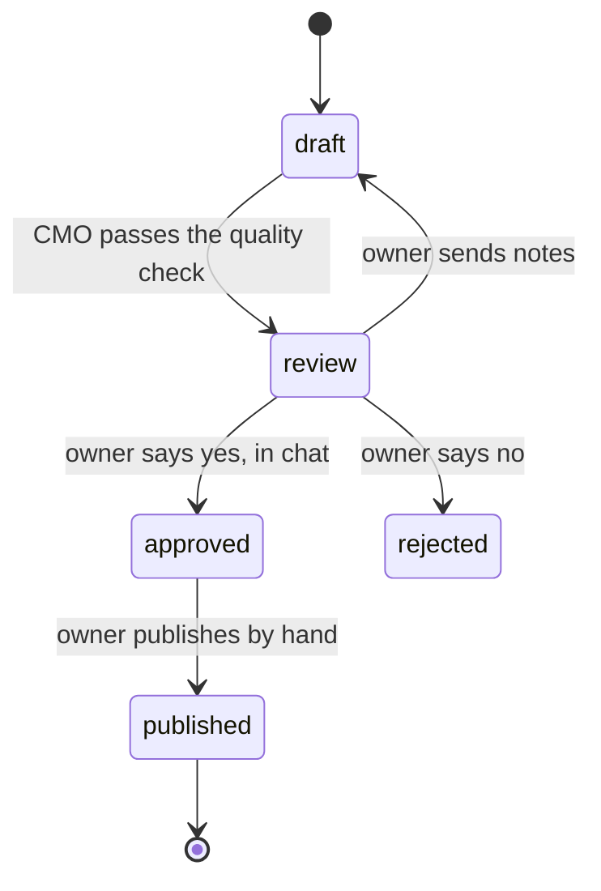

<div align="center">

# Wiseup Marketing

**A complete marketing department for any Claude Code project.**
One CMO orchestrator, nine specialist agents, and a self-contained `Marketing/` folder — dropped into a repository without disturbing it.

[](LICENSE)
[](https://code.claude.com/docs/en/plugins)
[](#changelog)
[](#the-team)
[](#skills)

</div>

---

## What it is

Most marketing tools for AI assistants are a pile of prompts. Wiseup Marketing is an **org chart**.

You talk to one agent — the CMO. It plans the work, delegates to the specialist who owns that area, reviews what comes back against a binding claims policy, and hands you a short summary in your language. Every deliverable is a real file, in a predictable place, with a status you control.

It ships **empty on purpose**. No brand colours, no fonts, no tone of voice, no prices, no channels — not even a reply language. All of that is information about *your* project, and WM captures it instead of assuming it.

```
You: "I need a content plan for next week"
       ↓
CMO   reads your brand, voice and claims policy
      delegates to social-media
      reviews the draft against the claims policy
       ↓
You:  social/2026-10/2026-W41_plan.md — 12 posts at status: review,
      plus 3 things only you can do.
```

Nothing is published, sent, scheduled or spent by an agent. Ever. That is not a setting.

---

## Quick start

```bash
claude plugin marketplace add deviddoe/wiseup-marketing
```

```bash
claude plugin install wiseup-marketing@wiseup
```

Restart the session, then in the project that needs marketing:

```
/wiseup-marketing:wm-init
```

**Seven questions and you are working.** WM reads your repository first — git state, visibility, project type, product name, the language you are writing in — and only asks what a filesystem cannot answer.

| | |
|---|---|
| 0 questions | it detects git, repo visibility, author count, project type, product name, domain |
| 1 confirmation | where `Marketing/` goes and how it stays out of your commits |
| 4 questions | reply language, customer language, product name, who approves |
| 3 questions | what the product does, the conversion action, what you want built first |
| → | it starts building that thing |

Everything else is asked **just in time** — by the agent that needs the fact, at the moment it needs it. The ads specialist asks for your budget ceiling when you build a campaign, not on day one.

### Then: build the foundation

Setup ends with a fork. Go straight to your first deliverable, or run the stage that makes everything afterwards sharper:

```
/wiseup-marketing:wm-foundation
```

Five documents, worked through one at a time with a grilling interview and a quality gate on each — because they depend on each other, and asking about tone before the offer is settled produces a tone for a product that does not exist yet.

| # | Document | Gate it must pass | Also produces |
|---|---|---|---|
| 1 | Product offering | a stranger could buy from it without asking a question | `claims-policy.md` |
| 2 | Brand context | exactly three pillars, each provable today | — |
| 3 | Brand voice | five we-say / never-say pairs, each with a reason | — |
| 4 | Brand style | a test banner renders and was looked at | `_brand/tokens.json` |
| 5 | Growth marketing | every goal has a number and a date; the stop rule is numeric | the first-tasks list |

Each one is read back to you and approved before the next opens. Stop and resume whenever — progress lives in the files, not in the conversation.

---

## It does not disturb the host project

This is the part most plugins get wrong. WM is a guest in a code repository, and it behaves like one.



| | Profile A | Profile B | Profile C |
|---|---|---|---|
| **When** | dedicated marketing folder | private code repo, solo | public repo, or a team |
| **Marketing folder** | committed | hidden via `.git/info/exclude` | hidden, sibling repo offered |
| **Plugin enabled in** | `.claude/settings.json` | `.claude/settings.local.json` | `.claude/settings.local.json` |
| **Tracked files touched** | one | **none** | **none** |

Three mechanics make this work, all of them native to Claude Code:

- **Project subagents are discovered by walking *up* from the working directory.** A session at the repository root never sees `Marketing/.claude/agents/`.
- **`Marketing/CLAUDE.md` loads only when Claude touches a file in that folder.** Your dev sessions stay clean.
- **`.git/info/exclude` is a personal ignore file that is never committed.** WM hides itself without editing your `.gitignore`.

WM never commits anything, never modifies a tracked file without naming it first, and never writes a secret where git can see it.

Already set up and want it checked?

```
/wm-doctor
```

It reports what would leak into git, which scope enables the plugin, what context is missing, and whether your brand tokens are complete — then offers fixes one at a time.

---

## Architecture

The plugin is an **engine** that knows nothing about any product. Every fact lives in `Marketing/_context/` inside your project. The same engine runs a Georgian booking SaaS and an English fintech app with no change to the plugin.



```
plugin (the engine)                  your project (the facts)
wiseup-marketing/                    <any project>/
├── agents/      9 specialists   +   └── Marketing/
├── skills/      the processes           ├── CLAUDE.md      the CMO for this project
├── commands/    /wm  /wm-doctor         ├── _context/      config · brand · product · claims
├── reference/   what WM must know       ├── _sop/          approval · conventions · checklist
└── scaffold/    the folder tree         ├── _templates/    post · ad · spec · banner · image
                                         ├── _brand/        tokens.json drives every visual
                                         ├── research/  social/  ads/  seo/
                                         ├── pages/  reports/  presentation/
                                         └── .wm/setup.json how WM placed itself
```

---

## The team

| Agent | Owns | Writes to |
|---|---|---|
| `researcher` | competitors, market size, customer pain, voice of customer | `research/` |
| `copywriter` | messaging, headlines, copy for every channel, brand brief, voice and claims review | `_context/`, `pages/` |
| `social-media` | content plans, posts, carousels, short-video scripts, visual briefs | `social/` |
| `ads-specialist` | campaign structure, targeting, keywords, copy variants, budget scenarios | `ads/` |
| `seo-specialist` | keyword research, blog plans, on-page requirements, technical SEO | `seo/` |
| `landing-cro` | landing page specs a developer can build from, funnel audits | `pages/` |
| `analyst` | KPIs, tracking plans, monthly reports, channel and CAC analysis | `reports/` |
| `presentation` | investor, partner and sales decks | `presentation/` |
| `outreach` | target lists from public business info, personalised messages | `research/outreach/` |

Turn off the ones a project does not need in `_context/00-config.md`; the CMO will not delegate to a disabled agent.

---

## Skills

**Process skills — the WM way of working**

| Skill | What it does |
|---|---|
| `wm-init` | set up the department: detect, place, ask seven questions, start |
| `wm-foundation` | the five foundation documents, grilled one at a time with a quality gate on each |
| `market-research` | a sourced competitor or market study, ending in implications |
| `weekly-social-plan` | next period's plan plus draft posts for every active channel |
| `ad-campaign` | a paid campaign end to end, with a pre-flight gate on analytics |
| `landing-spec` | a page spec with final copy, pricing, FAQ, events and acceptance criteria |
| `outreach-batch` | 25 targets with personalised messages, deduplicated against every past batch |
| `monthly-report` | KPIs against target, per-channel CAC, three recommendations |
| `banner-compose` | render a banner PNG with correct text over a brand background or AI image |
| `nano-banana-visual` | generate text-free images with Google Gemini, or prompts for manual use |

**Bundled toolbox** — 15 `market-*` skills from the [AI Marketing Suite](https://github.com/zubair-trabzada/ai-marketing-claude) and the `grilling` interview pair from [mattpocock/skills](https://github.com/mattpocock/skills). Both MIT, both attributed. Nothing extra to install.

---

## How work moves



| Status | Set by | Means |
|---|---|---|
| `draft` | the specialist agent | in progress |
| `review` | CMO, after the quality check | ready for you to look at |
| `approved` | CMO, **only after you say yes in chat** | may be published |
| `published` | CMO, when you say it is live | `published_at` and `url` recorded so the analyst can measure it |

Before anything reaches `review`, the CMO checks six things: on brief, claims policy, brand voice, language quality, CTA and UTM, correct file and folder. One claims violation sends it back to `draft`.

---

## Configuration

Everything WM knows about your project lives in `Marketing/_context/`, in English, as plain Markdown you can edit by hand.

| File | Holds |
|---|---|
| `00-config.md` | language, form of address, time zone, currency, segments, channels, primary CTA, UTM scheme, active agents |
| `product-offering.md` | plans, prices, billing, what is **live today** versus roadmap |
| `claims-policy.md` | **binding** — every claim that is allowed, and every one that is not |
| `brand-context.md` | positioning, promise, message pillars, who you are not for |
| `growth-marketing-context.md` | goals, funnel, KPIs, budget ceiling and stop rule, channel priority |
| `brand-voice-guide.md` | tone, glossary, per-channel notes |
| `brand-style-guide.md` | logo, colour, typography, layout, imagery rules |
| `technical-context.md` | stack, routing, i18n, who deploys |

A line that still says `TODO` is genuinely unknown, and no agent may guess it.

### Brand tokens

`Marketing/_brand/tokens.json` drives every rendered visual — colours per theme, the highlight colour, the font stack, wordmark SVG paths. It ships blank, and the renderer **refuses to run** while a value it needs is empty, naming exactly which one:

```
Brand tokens are not configured. Missing:
  - fonts.stack  (font stack)
  - dark.bg      (dark background colour)
Wiseup Marketing has no default palette on purpose.
```

`caseTransform` supports `none`, `upper` and `georgian-mtavruli`, for writing systems with a separate capital form.

### Why text is never generated inside an image

Image models garble text, and they garble non-Latin scripts badly. WM generates images **text-free**, then overlays the headline, badge, price and logo with an HTML template rendered by headless Edge or Chrome. Georgian, Armenian, Greek, Thai and Arabic come out right because a browser draws them, not a diffusion model.

---

## What it never does

1. **No agent publishes, sends, schedules or spends.** No social posts, no ad launches, no emails, no API writes. Deliverables stop at `review`.
2. **The claims policy is binding.** A capability you do not have yet cannot be claimed, however good the sentence would be.
3. **The product repository is read-only.** Landing pages ship as specs; a developer implements them.
4. **Outreach uses public business information only.** No scraping of platforms that forbid it, no personal data of private individuals, no guessed emails — and you send every message yourself.
5. **No invented numbers.** Missing data is marked missing, with the exact export needed to fill it.
6. **No borrowed defaults.** Not from an industry norm, not from another project.

---

## Cost

| | Tokens |
|---|---|
| Always-on, per session | ~1,630 |
| A specialist agent, when it runs | ~1,000 |
| A toolbox skill, when it fires | 5,000–7,500 |

Check it yourself with `claude plugin details wiseup-marketing`.

**Enable it per project, not globally.** `wm-init` writes the enablement into the right scope for you. A backend repository with no marketing should never load this plugin.

---

## Requirements

- **Node** — no `npm install`, no dependencies
- **Microsoft Edge or Google Chrome** — for rendering banners
- **`gh` CLI** *(optional)* — lets WM read repository visibility and choose a safer setup profile
- **`GEMINI_API_KEY`** in `Marketing/.env` *(optional)* — for AI image generation; without it, WM writes prompts for you to run by hand

---

## FAQ

**Does it work in a language other than English?**
Yes. The first question is which language the CMO should speak to you in; every customer-facing deliverable is written in the language you set. The `_context/` files stay in English so the agents read one consistent source.

**Will it commit anything to my repository?**
No. WM never runs a git command that writes. In profiles B and C it does not modify a single tracked file.

**I already ran it in the wrong place. Now what?**
`/wm-doctor`. It finds what is exposed, what scope is enabled and what is tracked that should not be, and offers each fix separately.

**Can I use only some of the agents?**
Yes — mark the rest inactive in `00-config.md`. The CMO will not delegate to them.

**Can I edit the context files by hand?**
That is the intended way. They are plain Markdown. The agents re-read them on every task.

**What if I have no brand yet?**
Say so in the brand round. WM records it, refuses to invent a palette, and puts a brand brief from the `copywriter` agent at the top of your first-tasks list.

**Does it replace a marketing team?**
No. It removes the blank page, the inconsistency and the forgetting. A human still decides, approves and publishes — by design, in several places at once.

---

## Contributing

Issues and pull requests are welcome.

- Keep the engine free of project data. Anything specific to one product belongs in `_context/`, not in an agent or a skill.
- New skills go in `skills/<name>/SKILL.md` with `name` and `description` frontmatter. Keep descriptions short — every one is paid for in every session.
- Run `claude plugin validate .` before opening a pull request.
- Bundling third-party work means recording it in `THIRD-PARTY.md`, adding the licence text under `licences/`, and leaving an attribution footer in the file.

---

## Licence and attribution

MIT — see [LICENSE](LICENSE).

Wiseup Marketing bundles two MIT-licensed projects, with attribution and licence texts preserved:

| Bundled | From | Licence |
|---|---|---|
| the 15 `market-*` toolbox skills | [AI Marketing Suite](https://github.com/zubair-trabzada/ai-marketing-claude) by Zubair Trabzada | MIT |
| `grilling`, `grill-me` | [mattpocock/skills](https://github.com/mattpocock/skills) by Matt Pocock | MIT |

[THIRD-PARTY.md](THIRD-PARTY.md) records the source, the licence and every modification. If you fork this, keep that file, `licences/` and the attribution footers intact — that is the whole of what MIT asks.

---

## Changelog

**1.2.0** — adds `wm-foundation`: the five foundation documents, grilled one at a time with a quality gate on each, producing the claims policy and the brand tokens as by-products.
**1.1.0** — setup is detected rather than asked: three placement profiles, a single confirmation, and a two-round interview that starts work after seven questions. Everything else is asked just in time. Adds `/wm-doctor`.
**1.0.1** — always-on descriptions trimmed by 45% (~2,193 → ~1,630 tokens per session).
**1.0.0** — first public release. Licensing resolved and attributed; MIT throughout.
**0.2.0** — renamed to Wiseup Marketing; every project assumption removed; interview rebuilt around a four-tier context checklist.
**0.1.0** — first port, from a working marketing department built for a real product.
